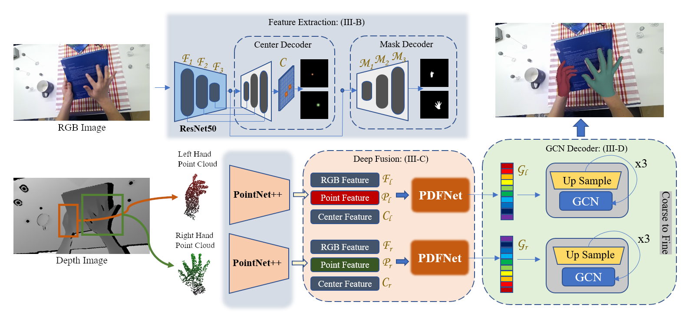
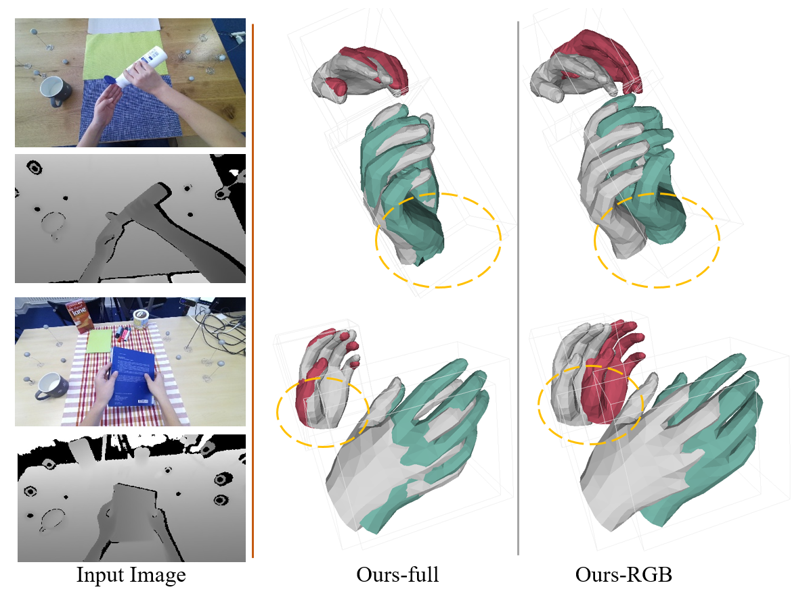

# PDFNet: Pyramid Deep Fusion Network for Two-Hand Reconstruction from RGB-D Images

## Introduction
* This repo is official **[PyTorch](https://pytorch.org)** implementation of **[Pyramid Deep Fusion Network for Two-Hand Reconstruction from RGB-D Images](https://arxiv.org/abs/2307.06038)**. 

### Overview of the proposed framework
<p align="middle">
    
</p>

### Visual comparison of RGB only and RGB-D input.
<p align="middle">
    
</p>

## Install
*   Environment
```
    conda create -n PDFNet python=3.7
    conda activate PDFNet

    # If you failed to install pytorch, you may try to modify your conda source: https://mirrors.tuna.tsinghua.edu.cn/help/anaconda/
    conda install pytorch==1.10.1 torchvision==0.11.2 torchaudio==0.10.1 cudatoolkit=11.3 -c pytorch -c conda-forge
    
    # install pytorch3d from source if you are not using latest pytorch version
    conda install -c fvcore -c iopath -c conda-forge fvcore iopath
    conda install -c bottler nvidiacub
    conda install pytorch3d -c pytorch3d

    pip install -r requirements.txt    
```

## Directory

### Root
The `${ROOT}` is described as below.
```
${ROOT}
|-- data
|-- lib
|-- outputs
|-- scripts
|-- assets
```
* `data` contains packaged dataset loaders and soft links to the datasets' image and annotation directories.
* `lib` contains main codes for SMHR, including dataset loader code, network model, training code and other utils files.
* `scripts` contains running scripts.
* `outputs` contains log, trained models, imgs, and pretrained models for model outputs.
* `assets` contains demo images.

### Data
You need to follow directory structure of the `data` as below. (recommend to use soft links to access the datasets)
```
${ROOT}
|-- data
|   |-- H2O
|   |   |-- ego_view
|   |   |   |-- subject*
|   |   |-- label_split
|   |-- H2O3D
|   |   |-- evaluation
|   |   |-- train
|   |   |***.txt
|   |***.pth 
|   |***.pkl
```
* Download the H2O dataset from the [[website](https://h2odataset.ethz.ch/)]
* Download the H2O3D dataset from the [[website](https://www.tugraz.at/index.php?id=57823)]
* Download pre-trained models and dataset loaders here [[cloud](https://pan.baidu.com/s/19iJi5IoBwhxd91S7dmI4cw)] (Extraction code: 83di) and put them in the `data` folder.


## Demo on two-hand samples
* Prepare RGB-D image pairs into assets.
*  Modify `demo.py` to use images from H2O dataset. 
    #L100:   base_dir = 'assets/H2O/color'
*  run ` bash scripts/demo.sh`
*  You can see rendered outputs in `outputs/color/`.


### Training and Evaluation
    Coming Soon...


### Outputs of images from H2O test set
<p align="middle">
    
    
</p>

## Acknowledgement

The pytorch implementation of PointNet++ is based on [Hand-Pointnet](https://github.com/3huo/Hand-Pointnet/). The GCN network is based on [IntagHand](https://github.com/Dw1010/IntagHand). We thank the authors for their great job!

## Citation

If you find the code useful in your research, please consider citing the paper.

```
@article{RenPDFNet,
title={Pyramid Deep Fusion Network for Two-Hand Reconstruction from RGB-D Images},
author={Jinwei Ren, Jianke Zhu},
booktitle={Arxiv},
month=july,
year={2023},
}
```
